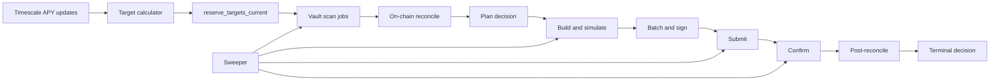

# Yield Orchestrator Loop Architecture

## Requirement Coverage

| Requirement | Proposed answer |
| --- | --- |
| Solid orchestrator loop architecture | Use a durable, stage-based pipeline whose source of truth is Postgres state plus chain reconciliation. |
| Multi-step pipeline | Split into target calculation, vault scan, reconcile, plan, simulate, batch, submit, confirm, and post-reconcile stages. |
| Well structured | Each stage owns one transition, one queue/status family, and one small worker API. |
| Expandable | Start as one worker binary with internal worker groups; split stages into services later without changing the durable contracts. |
| Heavy loads | Coalesce APY updates, shard by cluster/mint/vault, use DB leases, cap concurrency, rate-limit RPC, and apply backpressure at every stage. |
| Unpredictable conditions | Treat RPC errors, 429s, blockhash expiry, lost submissions, stale state, and process death as expected states with explicit retries. |
| Restarts | All work, leases, attempts, signed transactions, cursors, and terminal outcomes are persisted. In-memory state is only a cache. |
| Single process vs external services | Start single process with separated Tokio worker groups and Postgres-backed queues. Add Redis/Kafka/separate services only after measured need. |
| Persistence | Postgres stores cursors, targets, jobs, decisions, attempts, batches, signed txs, audit events, and dead letters. |
| Concurrent DB load | Use `FOR UPDATE SKIP LOCKED`, short transactions, idempotency keys, partial indexes, per-vault active-decision uniqueness, and staged writes. |
| Monitoring | Emit queue depth, lag, decision age, RPC rate/errors, DB pool pressure, batch outcomes, and reconciliation drift metrics. |
| Solana RPC cache layer | Add cache-aside storage for non-volatile Solana account data with in-process LRU plus persistent DB cache. Do not cache balances/blockhash as truth. |
| Solana RPC 429s | Use per-endpoint token buckets, adaptive concurrency, exponential backoff, request coalescing, and separate read/simulate/submit/confirm budgets. |
| Submitted tx silently disappears | Persist signed tx before broadcast, rebroadcast until blockhash expiry, poll signature status, then replan from fresh state after expiry. |
| DB concurrent writes in same place | Row leases, status compare-and-set updates, advisory/row locks for vault-critical sections, and unique active-decision indexes. |
| DB synced with actual state | Reconcile before planning, simulate at fresh slot, post-reconcile after confirmation, and periodically sweep/reconcile active vaults. |

## Core Decision

Build the orchestrator as a durable database-backed pipeline.

Do not use an in-memory queue as the source of truth. In-memory worker channels are fine for local scheduling inside one process, but any work item that matters must exist in Postgres before it is acted on.

Do not add Kafka, SQS, or Redis queues for the first production version. They add operational surface without solving the main correctness problems. This workload is primarily correctness-bound: one active movement per vault, idempotent retries, reproducible decisions, transaction confirmation, and auditability. Postgres is a better first queue because it can enforce the same constraints that protect money movement.

Start with one deployable binary:

```text
crates/loyal-yield-worker
```

That binary should compose:

- `loyal-yield-router` for Timescale APY reads.
- `loyal-yield-orchestrator` for durable decision state.
- `loyal-actions` for Squads route/action construction.
- A new production Kamino instruction/reconciliation module.
- A Solana RPC client layer with cache, rate limiting, submission, and confirmation logic.

Inside the binary, run separate worker groups. Each group should be independently configurable and stoppable. Later, any worker group can become a separate service because the boundary between groups is the database, not process memory.

## High-Level Flow



The pipeline should be level-triggered, not only event-triggered. `LISTEN` and in-process notifications are wakeups. Durable tables are the truth. If notifications are missed, the next poll/catch-up sweep continues from persisted cursors and queue rows.

## Pipeline Stages

### 1. Target Calculator

Input:

- Timescale `reserve_updates_after(cursor)` catch-up rows.
- Periodic `latest_reserves(filter)` refresh.
- Existing active policy allowlists from the orchestrator DB.

Output:

- `reserve_targets_current`: one current target reserve per `(cluster, liquidity_mint, strategy)`.
- Optional `reserve_target_snapshots`: append-only history of why the target changed.
- `worker_cursors`: durable Timescale cursor.

Rules:

- Coalesce APY updates by liquidity mint.
- Do not fan out all vault work if the target reserve did not change.
- Reject stale rows, low-supply rows, unsupported markets, unsupported mints, non-finite APY, and APY prints outside sanity bounds.
- Store the exact observed cursor/slot/time used for the target decision.
- Write target updates with an idempotency key such as `(cluster, liquidity_mint, target_reserve, observed_cursor, strategy_version)`.

Heavy-load behavior:

- Batch Timescale catch-up reads.
- Process target updates per mint.
- Apply a debounce window before fanout if many reserves update together.
- Persist latest cursor only after target writes succeed.

### 2. Vault Scan

Input:

- Current target reserve by mint.
- Active `managed_vaults`.
- Active `route_policies`.

Output:

- `vault_reconcile_jobs` or directly claimed reconcile rows.

Rules:

- Scan only vaults whose active policy allows `same_mint`, the target liquidity mint, and the target Kamino market.
- Exclude vaults with active decisions.
- Use fanout windows instead of enqueuing all users at once.
- Use idempotency key `(vault_id, liquidity_mint, target_reserve, target_epoch)`.

Heavy-load behavior:

- Page by `vault_id`.
- Limit fanout per target change.
- Keep a delayed continuation row if the fanout is too large for one pass.

### 3. Reconciliation

Input:

- Claimable reconcile jobs.
- Active policy metadata.
- Solana RPC account data.
- Kamino reserve metadata cache.

Output:

- `vault_position_snapshots`.
- `vault_reserve_positions_current`.
- Reconcile job terminal status.

Rules:

- Chain state is the source of truth for balances and account existence.
- Include zero-balance candidate reserves for the same mint so the planner can target a reserve the vault is not currently deposited into.
- Store account pubkeys, reserve account metadata, and observed slots in snapshot `planning_metadata`.
- Mark snapshots stale if RPC slot lag is too high.
- Do not hold DB locks while performing Solana RPC calls.

Concurrency:

- Claim a job with `FOR UPDATE SKIP LOCKED`.
- Release the DB transaction.
- Perform RPC reads.
- Re-open a short transaction to write the snapshot.
- Use compare-and-set on job status and lease owner when writing results.

### 4. Planning

Input:

- Current reserve target.
- Fresh vault position snapshot.
- Active policy allowlist.

Output:

- `rebalance_decisions` with status `planned` or `skipped`.

Rules:

- There must be at most one active decision per vault. Keep the partial unique index on active decision statuses.
- Plan only from the current valued source reserve for the mint to the target reserve.
- Skip if source already equals target.
- Skip if source/target account setup is missing.
- Skip if target has become stale or changed since the reconcile job was created.
- Store `source_snapshot_id`, target epoch/cursor, and strategy version.

Concurrent write handling:

- Use the active-decision unique index as the final guard.
- Use a deterministic idempotency key such as `(vault_id, source_snapshot_id, target_reserve, amount_raw, strategy_version)`.
- If a duplicate is inserted by a racing worker, fetch the existing row and continue idempotently.

### 5. Build And Simulate

Input:

- Planned decision.
- Snapshot `planning_metadata`.
- Kamino instruction builder.
- Solana RPC simulation client.

Output:

- `rebalance_attempts`.
- Decision status `ready`, `failed`, or `abandoned`.

Rules:

- Re-read decision and snapshot under a short lock before building.
- Build real Kamino redeem and deposit instructions from the stored account graph.
- Wrap those as one Squads policy execution instruction.
- Simulate the full route instruction or candidate batch.
- Store simulation slot, units consumed, logs hash, and failure classifier.
- If simulation fails because the chain state drifted, enqueue a fresh reconcile instead of retrying the same attempt.

### 6. Batch And Sign

Input:

- Ready decisions.
- Batch configuration.
- Blockhash cache.
- Address lookup table cache if enabled.

Output:

- `rebalance_batches`.
- `rebalance_batch_decisions`.
- Signed transaction bytes.

Rules:

- Batch by cluster, signer, fee payer, transaction version, and compatible lookup tables.
- Do not put two decisions for the same vault in one batch.
- Start with `N = 1` or `N = 2`; raise only after real same-mint route packet/compute measurements.
- Persist the serialized signed transaction before first broadcast.
- Persist blockhash and last valid block height with the batch.

This signed-before-broadcast rule is critical. If the process dies after signing, the exact transaction can be rebroadcast. If the process dies before signing, the decision is still ready and can be rebuilt.

### 7. Submit

Input:

- Persisted signed transaction batch.

Output:

- Batch status `submitted`.
- Decision status `submitted`.

Rules:

- A returned signature means the RPC accepted the request; it does not mean the transaction landed.
- Submitter should be idempotent: rebroadcast the same bytes while the blockhash is valid.
- Use at least two RPC endpoints if available, but avoid blasting both immediately unless primary submit is unhealthy.
- Record every broadcast attempt, endpoint, latency, RPC error, and send config.

Handling silent disappearance:

- Do not mark failed only because the submit call returned no immediate status.
- Poll signature status until confirmed/finalized or blockhash expiry.
- Rebroadcast while the blockhash remains valid and the signature has no terminal status.
- After expiry, mark the batch attempt expired and replan from fresh reconcile state.

### 8. Confirm

Input:

- Submitted batch signature.
- Last valid block height.

Output:

- Confirmed or expired batch.
- Per-decision terminal status.
- Post-confirmation reconcile jobs.

Rules:

- Poll `getSignatureStatuses` and, when needed, transaction details.
- Confirmation level should be configurable; default to finalized for money movement unless operationally too slow.
- If transaction lands with error, mark all included decisions failed with the chain error.
- If status is unknown until blockhash expiry, classify as expired/unknown and rebuild from fresh state.
- If status is confirmed, enqueue post-reconcile for every vault in the batch.

### 9. Post-Reconcile

Input:

- Confirmed decisions.
- Chain state after confirmation.

Output:

- Fresh position snapshot.
- Decision `confirmed` only when post-state matches the intended move.

Rules:

- A confirmed transaction is not enough by itself. Reconcile post-state and verify source/target balances.
- If post-state does not match, mark as `failed` or `needs_manual_review` depending on severity.
- Keep an audit link from decision to pre-snapshot, batch, signature, and post-snapshot.

### 10. Sweeper

Input:

- All non-terminal queue/status tables.

Output:

- Reclaimed leases, retried jobs, expired batches, dead letters, alerts.

Rules:

- Expire leases whose `lease_expires_at < now()`.
- Retry retryable failures after `next_attempt_at`.
- Move repeatedly failing work to dead letter with a reason.
- Reconcile active vaults periodically even without APY changes.
- Detect decisions stuck in `submitted` or `confirming`.

## Queue And Lease Model

Every durable work table should have:

```text
id
status
lease_owner
lease_expires_at
attempt_count
next_attempt_at
last_error_code
last_error_message
created_at
updated_at
idempotency_key
```

Claim query shape:

```sql
SELECT id
FROM loyal_yield.some_queue
WHERE status = 'pending'
  AND next_attempt_at <= now()
ORDER BY priority DESC, created_at ASC
LIMIT $1
FOR UPDATE SKIP LOCKED;
```

Then update claimed rows in the same transaction:

```sql
UPDATE loyal_yield.some_queue
SET status = 'leased',
    lease_owner = $worker_id,
    lease_expires_at = now() + $lease_duration,
    attempt_count = attempt_count + 1,
    updated_at = now()
WHERE id = ANY($ids);
```

Workers should update results with compare-and-set conditions:

```sql
UPDATE loyal_yield.some_queue
SET status = 'succeeded',
    updated_at = now()
WHERE id = $id
  AND lease_owner = $worker_id
  AND status = 'leased';
```

This prevents stale workers from overwriting newer work after a lease timeout.

## Persistence Model

Minimum new persistent entities:

- `worker_cursors`: durable Timescale and sweeper cursors.
- `reserve_targets_current`: current best target by mint.
- `reserve_target_snapshots`: append-only target history.
- `vault_reconcile_jobs`: durable reconcile queue.
- `rebalance_attempts`: build/simulate attempts for decisions.
- `rebalance_batches`: signed/submitted transaction batches.
- `rebalance_batch_decisions`: batch-to-decision join table.
- `solana_account_cache`: cache-aside table for non-volatile Solana account data.
- `worker_events`: append-only audit events for debugging and replay.

Existing tables should remain:

- `route_policies`.
- `managed_vaults`.
- `vault_position_snapshots`.
- `vault_reserve_positions_current`.
- `rebalance_decisions`.

The existing `rebalance_decisions_one_active_per_vault_idx` is the right safety primitive. Keep it and make worker code treat unique-conflict errors as normal races.

## Solana RPC Layer

### Cache Layer For Non-Volatile Data

Add a Solana account cache in front of RPC for data that changes rarely or is immutable for our purposes:

- Kamino reserve metadata.
- Lending market authority and reserve account graph.
- Mint metadata and decimals.
- Program IDs and program-owned static config.
- Address lookup table accounts.
- Squads policy account metadata after detection, with explicit refresh on policy monitor updates.

Use two tiers:

1. In-process LRU/TTL cache for hot reads.
2. Persistent Postgres cache table for restart survival and multi-worker sharing.

Suggested cache fields:

```text
cluster
pubkey
owner
lamports
data_hash
data_bytes or decoded_json
observed_slot
expires_at
cache_class
```

Do not use this cache as truth for volatile data:

- Token balances.
- Recent blockhashes beyond their real validity.
- Signature status.
- Vault current positions.
- Anything used to mark a decision confirmed.

Volatile data must come from fresh RPC reads and be persisted as snapshots with observed slot.

### 429 Handling

Treat 429 as backpressure, not as an exceptional crash.

RPC client rules:

- Separate request budgets for account reads, simulation, submission, and confirmation.
- Token bucket per endpoint and per request class.
- Adaptive concurrency that lowers limits after 429/timeout spikes and slowly recovers.
- Exponential backoff with jitter.
- Prefer `getMultipleAccounts` batching for account reads.
- Coalesce duplicate metadata reads through the cache layer.
- Circuit-break unhealthy endpoints.
- Keep submit/confirm capacity reserved so metadata scans cannot starve transaction handling.

Worker behavior on 429:

- Account metadata read 429: retry through cache/backoff.
- Balance read 429: retry, then release job with delayed `next_attempt_at`.
- Simulation 429: release attempt with delayed retry.
- Submit 429: try another endpoint or delayed rebroadcast while blockhash remains valid.
- Confirm 429: slow polling and keep batch in confirming until blockhash expiry or status appears.

### Submitted Transaction Disappears

Solana submission must be modeled as "accepted for gossip maybe", not "landed".

Required behavior:

1. Sign and persist serialized transaction bytes before first broadcast.
2. Store signature, blockhash, last valid block height, endpoint attempts, and batch rows.
3. Broadcast the same bytes.
4. Poll signature status.
5. Rebroadcast the same bytes while the blockhash remains valid and no terminal status exists.
6. After blockhash expiry, mark the batch attempt expired.
7. Reconcile the affected vaults.
8. Replan from fresh chain state if the move is still needed.

Never create a second different transaction for the same active decision while the first blockhash is still valid. That avoids duplicate movement if the first transaction was merely delayed.

## Database Concurrency And Load

### Multiple Concurrent Writes

Use the database to make races harmless:

- One active decision per vault via partial unique index.
- Queue rows claimed with `FOR UPDATE SKIP LOCKED`.
- Compare-and-set status transitions.
- Idempotency keys for target updates, reconcile jobs, decisions, attempts, and batches.
- Short transactions only.
- No DB locks while waiting on Solana RPC.
- Optional `pg_advisory_xact_lock(hash(vault_id))` only around critical per-vault writes if row-level locks are not enough.

Avoid write hot spots:

- Do not update one global "last seen" row on every event.
- Keep per-worker cursors keyed by `(worker_kind, cluster, partition_key)`.
- Partition large queue scans by cluster/mint/status.
- Use append-only event rows for audit instead of repeatedly rewriting large JSON blobs.
- Use partial indexes on hot statuses, for example `status IN ('pending', 'leased')`.

### Staying Synced With Actual State

The database is durable orchestration state, not the final truth for funds. Chain state wins.

Rules:

- Reconcile before planning.
- Store `source_snapshot_id` on every decision.
- Build only from the snapshot/account graph that was planned.
- Recheck freshness before simulation.
- Simulate before signing.
- Confirm by signature status.
- Post-reconcile after confirmation.
- Periodically reconcile active vaults even without target changes.
- If DB state and chain state disagree, pause the affected vault and create a manual-review event or fresh reconcile job.

The worker should never mark a move successful based only on "transaction submitted" or "decision row updated".

## Monitoring

Metrics:

- Queue depth by stage/status.
- Oldest pending job age.
- Lease expirations by worker kind.
- Dead-letter count by reason.
- Timescale cursor lag.
- Reserve target age by mint.
- Vault reconcile age and chain slot lag.
- Decisions by status and age.
- Simulation success/failure rate.
- Batch size, compute units, packet size, transaction version.
- Submitted-to-confirmed latency.
- Unknown-until-expiry transaction count.
- RPC requests by endpoint/method/status.
- RPC 429 rate and adaptive concurrency level.
- DB pool usage, acquire latency, query latency, lock wait time.
- Post-reconcile drift rate.

Logs:

Every structured log line should include the relevant IDs when available:

```text
worker_kind
worker_id
cluster
liquidity_mint
vault_id
decision_id
attempt_id
batch_id
signature
source_reserve
target_reserve
target_epoch
slot
```

Alerts:

- Cursor lag above threshold.
- Oldest pending queue age above threshold.
- Submitted/confirming decisions stuck near blockhash expiry.
- High RPC 429 or timeout rate.
- Simulation failures spike.
- Post-reconcile drift detected.
- DB pool saturation.
- Dead letters above zero for money-moving stages.

## Deployment Path

### Phase 1: Single Process, Shadow Mode

Run one `loyal-yield-worker` binary with all worker groups enabled except submit.

It should:

- Consume APY updates.
- Calculate targets.
- Reconcile vaults.
- Plan decisions.
- Build and simulate routes.
- Persist all audit data.
- Not submit transactions.

This proves DB load, RPC load, cache hit rate, and decision quality without moving funds.

### Phase 2: Single Process, `N = 1` Execution

Enable submit for one decision per transaction.

This proves:

- Signed transaction persistence.
- Rebroadcast logic.
- Confirmation worker.
- Post-reconcile correctness.
- Retry and expiry behavior.

### Phase 3: Batching

Increase batch size behind config after measurement.

Measure:

- Packet size.
- Compute units.
- Account locks.
- RPC simulation stability.
- Confirmation latency.
- Failure blast radius.

### Phase 4: Split Services Only If Needed

Split into separate services only when metrics show pressure:

- Target service if Timescale/APY catch-up is heavy.
- Reconcile service if Solana account reads dominate.
- Execution service if signing/submission needs tighter isolation.
- Confirmation service if many signatures are in flight.

The split should not change tables or status transitions.

## External Services And Caches

Required:

- Orchestrator Postgres.
- TimescaleDB/APY source.
- Solana RPC endpoints.
- Metrics/logging stack, preferably OpenTelemetry plus Prometheus/Grafana or equivalent.

Recommended first cache:

- In-process LRU/TTL plus Postgres-backed `solana_account_cache`.

Optional later:

- Redis for shared hot metadata cache and distributed rate-limit counters if multiple service instances make the DB cache too chatty.
- Kafka/SQS/Redpanda only if upstream event volume outgrows Postgres queue tables. Even then, keep Postgres as the execution state and idempotency authority.
- Dedicated transaction relayer only if direct RPC submission proves unreliable or operationally burdensome.

## Implementation Guardrails

- Every stage transition must be restart-safe.
- Every external side effect must have a persisted attempt row.
- Every transaction must be signed and persisted before broadcast.
- Every retry must be idempotent or must re-read fresh chain state.
- No stage may rely on in-memory queue contents for correctness.
- No DB transaction may wait on Solana RPC.
- No confirmed decision without post-reconcile.
- No cached volatile balances for planning or confirmation.
- No broad fanout on APY updates unless the max target for a mint actually changed.

## Open Design Choices

These are configuration or product decisions, not architecture blockers:

- Exact APY smoothing and target-change threshold.
- First batch size.
- Confirmation level.
- Whether missing target accounts are auto-created or skipped.
- Whether Redis is useful after shadow-mode measurements.
- Whether the worker lives as a new crate or a binary under `loyal-yield-orchestrator`.

The architectural contract should stay the same either way: durable stage tables, idempotent transitions, RPC cache/backpressure, post-state reconciliation, and observable queue health.
