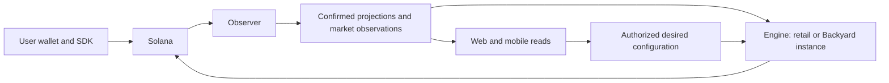

**Loyal worker v2: fresh source audit and implementation outline — 2026-10-02**

Recommendation: consolidate autonomous orchestration into one Go module, with an observer process and two instances of the same engine binary: retail Earn and Backyard. Keep credentials separate. Preserve the existing SSE service initially. The first useful delivery is Autodeposit progressing correctly without anyone opening the web or mobile app.

The [data, algorithm and Go follow-up study](worker-v2-data-algorithms-go-2026-10-02.md) adds unit/coverage defects, a reproduced heap-ranking gap, and a more precise package and validation design. Treat those intentional behavior corrections separately from a mechanical parity port.

This is a source audit and implementation proposal. No implementation, production inspection, database migration, deployment, or writer cutover occurred.

**Audit basis**

Freshly fetched main revisions, inspected in clean detached worktrees:

| Repository | Revision | Audit checkout |
| --- | --- | --- |
| Loyal Apps | `81b5c0256317c46e4fa9fdac49d6c0b347530b03` | `/private/tmp/loyal-v2-app-audit-20261002` |
| Loyal Yield Routing | `05338bbb70ce2e5287956f6e3659964e37bfa2f6` | `/private/tmp/loyal-v2-yield-audit-20261002` |

The shared feature checkouts and their uncommitted changes were preserved. Independent audits covered app authority, shared Go primitives, read models, and durable execution/port order. Current main and a dirty feature checkout differed materially in Backyard implementation maturity; this proposal uses the fresh main revisions above.

**What the code actually says**

1. **App reads still orchestrate.** Web Earn state and mobile Autodeposit state routes repair artifacts, pause/resume targets, discover balances, schedule bootstrap sweeps, and clear stale scheduling. Transaction GETs also synchronize holding events; the explicit position-reconcile endpoint can write a portfolio snapshot. Worker progress therefore has several producers, including product reads. These are the highest-value deletion targets. See [web state](https://github.com/loyal-labs/loyal-app/blob/81b5c0256317c46e4fa9fdac49d6c0b347530b03/apps/web/src/app/api/smart-accounts/yield-optimization/earn-state/route.ts#L395), [mobile state](https://github.com/loyal-labs/loyal-app/blob/81b5c0256317c46e4fa9fdac49d6c0b347530b03/apps/web/src/app/api/smart-accounts/mobile/earn/autodeposit/state/route.ts#L346), and [position reconciliation](https://github.com/loyal-labs/loyal-app/blob/81b5c0256317c46e4fa9fdac49d6c0b347530b03/apps/web/src/lib/yield-optimization/earn-position-reconciliation.server.ts#L94).

2. **User signing already has a deliberate boundary.** Web/mobile build through the shared wallet SDK and the user wallet signs/sends. Deposit and withdrawal confirmation cores verify receipts; they do not write the resulting Earn positions. The withdrawal core explicitly assigns resulting-state writing to LaserStream. Preserve this boundary. Full withdrawal closes Autodeposit, resolves actual live holdings, and handles cleanup separately after withdrawal. See [withdraw confirmation](https://github.com/loyal-labs/loyal-app/blob/81b5c0256317c46e4fa9fdac49d6c0b347530b03/apps/web/src/lib/yield-optimization/earn-withdraw-confirm.server.ts#L578) and [mobile withdrawal](https://github.com/loyal-labs/loyal-app/blob/81b5c0256317c46e4fa9fdac49d6c0b347530b03/apps/mobile/src/lib/solana/earn/withdraw.ts#L571). Retail vault index 1 and legacy agent vault index 0 remain distinct.

3. **There are substantial Go foundations to reuse.** Current main contains roughly 9,100 non-test Go lines in the fleet planner and 8,400 in Backyard. Backyard includes fenced ownership, signed-wire persistence, broadcast intent, and recovery. Its lease-owner validator still requires a Render-specific identity. Port that boundary to a platform-neutral deployment-instance/release identity while preserving lease generations and stale-owner rejection. See [Backyard owner validation](https://github.com/loyal-labs/loyal-yield-routing/blob/05338bbb70ce2e5287956f6e3659964e37bfa2f6/go/backyard-rwa-worker/internal/backyardrwa/worker.go#L15) and [transaction lifecycle](https://github.com/loyal-labs/loyal-yield-routing/blob/05338bbb70ce2e5287956f6e3659964e37bfa2f6/go/backyard-rwa-worker/internal/backyardrwa/lifecycle.go#L10). Source maturity does not establish deployed runtime behavior.

4. **Durable ingestion and custody state carry real guarantees.** Stream admission stores reconciliation work and advances the capture cursor in one transaction. Application subsequently preserves per-vault ordering and commits deduplication, financial effects, and completion together. Captured-through and applied-through are different facts. Autodeposit pull and Kamino deposit are separate transactions with a durable handoff. Cross-mint recovery needs asset/account/amount/version checkpoints. Capacity can remain reserved after an operation completes until a newer reserve observation includes its effect. See [stream admission](https://github.com/loyal-labs/loyal-yield-routing/blob/05338bbb70ce2e5287956f6e3659964e37bfa2f6/crates/loyal-yield-store/src/store.rs#L651), [transaction boundary](https://github.com/loyal-labs/loyal-yield-routing/blob/05338bbb70ce2e5287956f6e3659964e37bfa2f6/AGENTS.md#L35), and [capacity release](https://github.com/loyal-labs/loyal-yield-routing/blob/05338bbb70ce2e5287956f6e3659964e37bfa2f6/crates/loyal-yield-orchestrator/src/fleet_orchestration/capacity.rs#L227).

5. **The APY surfaces have three different meanings.** Personal charts model accrual over actual exposure using sampled APY. Public strategy charts simulate hypothetical exposure. Public fleet realized APY uses share-price growth and contemporaneous fleet allocations. The new hourly allocations and share prices are recorded by an app cron, another scheduled responsibility to transfer. Keep these products and calculation versions distinct. See [personal calculator](https://github.com/loyal-labs/loyal-app/blob/81b5c0256317c46e4fa9fdac49d6c0b347530b03/apps/web/src/lib/yield-optimization/earnings-calculator.server.ts#L687), [hourly cron](https://github.com/loyal-labs/loyal-app/blob/81b5c0256317c46e4fa9fdac49d6c0b347530b03/apps/web/src/app/api/cron/earn-reserve-share-prices/route.ts#L20), and [allocation contract](https://github.com/loyal-labs/loyal-yield-routing/blob/05338bbb70ce2e5287956f6e3659964e37bfa2f6/crates/loyal-yield-store/migrations/0086_earn_fleet_allocations_hourly.sql).

**Target runtime**

The checked-in Render manifest declares 15 production worker services plus realtime SSE. That is a manifest inventory, not a verified running-service count. Consolidate those responsibilities into these deployment units:

| Process | Responsibilities | Authority |
| --- | --- | --- |
| `loyal-observer` | Stream admission and replay; balances/reserves/policies; confirmed receipts and projections; bounded hourly recordings and public simulation refresh; derived health | Explicit database writers for its projections; no transaction signer |
| `loyal-engine --scope=retail` | Autodeposit reconciliation and scheduling; fleet planning/admission; fresh revalidation; execution/recovery; lookup-table lifecycle | Existing bounded retail automation permissions |
| `loyal-engine --scope=backyard` | Existing bounded Backyard decisions, protocol builders, custody and recovery | Separate Backyard credentials and policy manifest |
| Existing realtime service | Authenticated invalidation, durable outbox replay, cursor expiry and resync | No signer |

Fresh RPC validation remains available to the engine before execution; a shared projection alone cannot establish spendable custody. Run these under ordinary process supervision on Hetzner, using PostgreSQL leases and fencing already present. Keep migrations, backfills and evidence tools as explicit operator commands.



One Go module is enough:

```text
cmd/loyal-observer/
cmd/loyal-engine/
cmd/loyal-evidence/
internal/observer/
internal/engine/
internal/autodeposit/
internal/fleet/
internal/backyard/
internal/solana/
internal/db/
```

Use concrete packages and typed family operations. Share RPC read behavior, wire codecs, receipt primitives, lease helpers, configuration, metrics and health where the existing implementations demonstrate reuse. Keep family SQL and custody transitions beside their domain. Preserve separate app/product, yield-control and Kamino/Timescale adapters and their transaction boundaries. Preserve the planner's lack of signing/broadcast APIs. Retain the small official KLend proxy and verified on-chain Rust/ABI surface until an independently justified replacement exists.

Each engine iteration should recover outstanding work first, observe a coherent snapshot, make one pure bounded decision, freshly validate it, persist its exact attempt, execute according to that attempt's recovery rules, and reconcile exact effects. Serialize autonomous custody per vault while admitting independent vaults concurrently within writable-account conflicts and reserve-capacity limits. Give ingestion, planning, recovery and hourly projection separate concurrency budgets so a slow historical query cannot block stream capture or unresolved transaction recovery.

**Implementation sequence**

| Slice | Concrete change | Acceptance criterion |
| --- | --- | --- |
| 1. Reuse the Go foundation | Put the existing fleet and Backyard code into one module without changing financial behavior. Introduce observer/engine entrypoints. Replace the Render-only owner format with an instance identity carrying immutable release and lease-generation evidence. | Existing pure decisions, exact messages, ownership rejection and restart recovery remain equivalent. No new signing capability enters the planner or observer. |
| 2. Port a complete Autodeposit family | Port reconciliation, scheduling, the existing two-leg journal/builders, execution and recovery into its Go owner. Move artifact recovery, eligibility, bootstrap discovery and stale-schedule repair out of app reads. App writes desired enable/floor/limit plus a revision; engine atomically rebaselines scheduling. | Setup, funding, floor changes, pause/close, process restart and missing-position recovery work with web/mobile closed. Revisions arriving during reconciliation remain pending. User enable intent survives temporary ineligibility. Existing cross-family idle-fund ownership still holds while legacy fleet execution remains active. |
| 3. Port the observer as a complete ingestion slice | Preserve the durable inbox/cursor transaction, per-vault ordering, receipt anchoring, deduplication and projection completion semantics. Move explicit app position reconciliation and transaction-GET synchronization behind durable reconciliation requests. | Duplicate, reordered and interrupted delivery converges to the same ledger and portfolio. Restart cannot acknowledge uncaptured work. Every bridge writer has a named replacement before it is removed. |
| 4. Consolidate retail execution | Bring opportunity planning, revalidation, execution, confirmation and reconciliation into the engine's typed lifecycle. Keep existing journal tables first. Introduce a compatible shared ownership gate across autonomous families where current journals do not already enforce it. Preserve separate Autodeposit pull/top-up and cross-mint custody checkpoints. | No simultaneous autonomous custody owner for a vault; idle funds remain owned through top-up; capacity stays held until the required newer telemetry; uncertain transactions cannot produce duplicate spending. |
| 5. Transfer scheduled read-model work | Move hourly allocation/share-price recording and public simulation refresh into bounded observer loops. Keep personal chart calculation and timezone/API formatting in TypeScript initially. Later move canonical exposure construction only after exact parity. | Forward samples preserve coverage classes, actual observation times, zero-return idle, calculation version and same-hour newer-sample rules. Missing historical allocations stay missing. Existing chart freshness and strict coverage behavior survive. |
| 6. Integrate Backyard and retire stage services | Use the same engine runtime with the existing Backyard decision/build/recovery module and separate credentials. Cut over one ownership family at a time. Retire each replaced service and its obsolete repair callers. | Restart, ambiguous-send and authority-boundary evidence passes for that family; old writers are fenced; unresolved attempts and reservations have an explicit owner. |

The first product milestone is slice 2. It can consume the existing Rust stream observations until slice 3. Shadow the complete Autodeposit family and cut over its ownership together; avoid leaving both old and new controllers scheduling the same target. Module consolidation should support that delivery, without expanding into a general workflow framework. Preserve released-mobile preparation fallbacks and existing HTTP shapes until their consumers can safely transition. Confirmation responses should distinguish receipt verification from projection completion; existing misleading labels require a compatibility-conscious update.

**Contracts that must survive the rewrite**

- Persist signed bytes, their hash and attempt identity before broadcast. Preserve the current family's distinction between signed-but-unsent recovery and ambiguous broadcast intent. Backyard intent/submitted recovery never blindly resends. Database fencing cannot revoke a signed Solana transaction.
- Keep externally signed Earn MAX receipts distinct from worker-signed attempts. External operations have transaction identity and confirmed effects without requiring fabricated worker wire/blockhash fields.
- Keep Autodeposit custody ownership between pull and top-up. The destination plan is frozen before pull broadcast. Combining the two transactions is prohibited by the current packet-size boundary.
- Keep cross-mint account/asset/amount/version checkpoints and exact finalized no-effect proof where required. A generic waiting status cannot replace them.
- Preserve capacity's `active -> awaiting_telemetry -> released` lifecycle. Terminal operation status alone does not release capacity.
- Preserve legacy event IDs, foreign keys and producer ranges through compatibility adapters until all consumers migrate.
- Preserve the first confirmed-deposit history boundary, principal checks, idle treatment, raw amount strings, timezone/DST buckets, four chart ranges, stale-cache signaling and incomplete-coverage errors.
- Keep SDK user signing, live withdrawal source resolution and separate post-withdraw cleanup. Worker leases cover autonomous ownership; user-authorized chain execution requires its existing on-chain and receipt safeguards.

**Verification and cutover**

Selected existing Backyard decision, recovery, receipt and builder tests passed on the fresh checkout using cached dependencies. The selected fleet planner tests did not reach execution: pinned `solana-go v1.14.0` was absent from the local cache and the attempted cache lock was outside sandbox write scope. No dependency versions were changed. No database, SVM, production or frontend build checks were run.

For implementation, reuse the existing offline fleet parity corpus, exact-message/SVM checks, and database tests for Autodeposit idle ownership, reconciliation-request coalescing, event-ID ranges and cross-mint movement. Reuse the Autodeposit atomic-finalization/deadlock verifiers and Earn calculator, coverage, client-freshness and single-writer checks. Add restart/crash assertions only at changed durable boundaries, including signed-before-intent, intent-before-send, send-before-receipt and pull-before-top-up. These checks require isolated fixtures and an explicitly bounded environment; passing source tests does not authorize production custody execution.

For each writer cutover: run the new code in read-only shadow mode; compare decisions/effects; enumerate every nonterminal operation, signed attempt, custody claim, capacity reservation and referenced lookup table; drain or adopt exact identities; fence the old owner; then activate one canary. Keep new admission disabled when unresolved old signed attempts cannot be safely adopted. Preserve old-reader/new-schema compatibility and recognize that binary rollback cannot undo financial execution.

Coordinate infrastructure/database authority changes separately from execution-family changes so failures have an identifiable cause. Success should be measured as app-independent progress, fewer independent writers and handoffs, removal of obsolete services/callers, preserved receipt correctness, bounded recovery latency and equal decision behavior. A defensible line-count reduction follows actual deletion; this audit does not promise a percentage before implementation.
